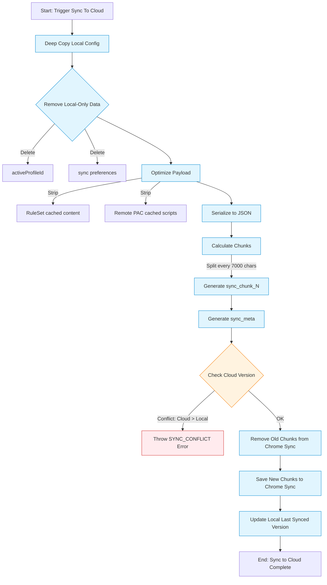
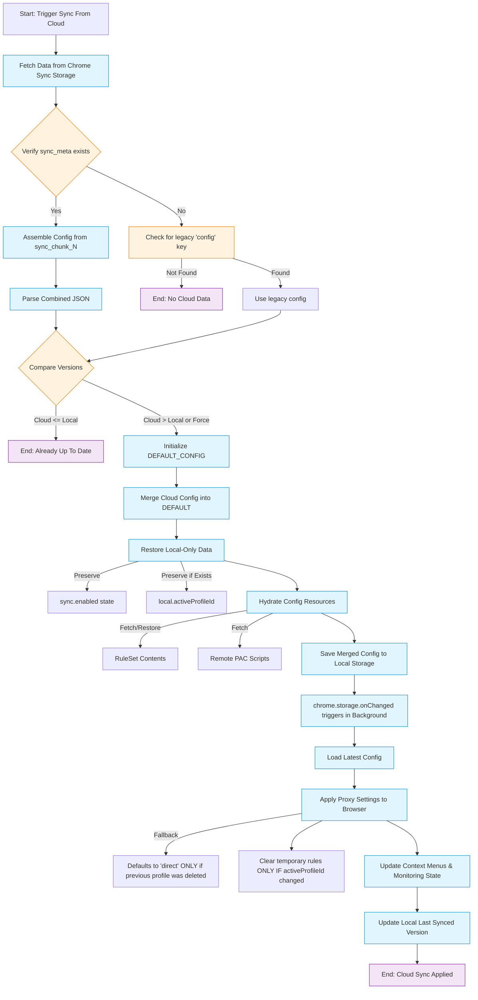

# Oasis Configuration Versioning & Synchronization Strategy

## 1. Overview

Oasis implements a robust multi-device synchronization system using `chrome.storage.sync`. The system prioritizes data integrity, storage efficiency, and accurate conflict detection using a strict versioning scheme.

## 2. Versioning Strategy

The configuration versioning relies on two fields in the root `config` object:

- **`version` (Integer)**: A strictly increasing counter representing the configuration generation.
- **`updatedAt` (Timestamp)**: The exact time (milliseconds) of the last significant local modification.

### 2.1. Increment Rules

The version number is incremented **ONLY** when a substantive change is made to the local configuration. This includes:

- Adding, editing, or deleting a Proxy, Policy, or PAC script.
- Modifying general settings (e.g., UI preferences, behavior).

The `touchConfig()` helper ensures that any such save operation performs:

```javascript
config.version = currentVersion + 1
config.updatedAt = Date.now()
```

### 2.2. Exclusions (No Version Increment)

The following actions do **NOT** increment the version number, ensuring that metadata reflects the _content_ rather than the _state_ of the browser:

- **Auto Sync Toggle**: Enabling or disabling Auto Sync is considered a local device preference.
- **Sync Push**: Uploading to the cloud publishes the _current_ version. It does not artificially increment the version.
- **Hydration**: Downloading cached content (e.g., remote RuleSet lists, remote PAC scripts) is considered a caching operation, not a configuration change.

## 3. Storage Architecture

Due to the limited size of `chrome.storage.sync` (100KB total, 8KB per item), Oasis uses a **Chunked Storage** approach.

### 3.1. Data Structure

The configuration is split into:

1.  **Metadata (`sync_meta`)**:
    - `version`: The configuration version.
    - `timestamp`: The `updatedAt` timestamp.
    - `count`: Total number of data chunks.

2.  **Data Chunks (`sync_chunk_0`, `sync_chunk_1`, ...)**:
    - The full configuration JSON is serialized and split into 7KB chunks (7000 bytes) to fit comfortably within the 8KB per-item limit.

## 4. Synchronization Flow

### 4.1. Push (Sync to Cloud)

When syncing _to_ the cloud (Manual or Auto):

1.  **Snapshot**: A copy of the current local configuration is created.
2.  **Optimization**:
    - **Strip Local-Only Data**:
      - `config.sync` settings (e.g., enabled state).
      - `config.activeProfileId` (Current active profile is device-specific).
    - **Strip Cache**: Heavy content is removed to save space:
      - `policy.rules[].ruleSet.content` (Cached RuleSet text)
      - `pac.script` (Cached remote PAC script)
    - _Note: Remote URLs are preserved, allowing the other device to re-fetch the content._
3.  **Chunking**: The optimized payload is chunked.
4.  **Upload**: Metadata and chunks are written to `chrome.storage.sync`.



### 4.2. Pull (Sync from Cloud)

When syncing _from_ the cloud:

1.  **Fetch & Reassemble**: All chunks are fetched and joined to reconstruct the JSON.
2.  **Merge**: The cloud configuration overwrites the local configuration.
3.  **Local Preservation**: Local-only settings (like `sync.enabled`) are restored to the new config.
4.  **Hydration**:
    - Because cached content was stripped during upload, the local client immediately performs a **Hydration** step.
    - It detects missing `content` for RuleSets and `script` for remote PACs.
    - It fetches these resources from their original URLs.
    - The fetched content is saved to local storage _without_ incrementing the version.



### 4.3. Auto Sync & Conflict Resolution

- **Trigger**: Auto Sync runs when enabled and a local change occurs.
- **Safety Check**: Before enabling Auto Sync, the client checks the Cloud Version.
  - **Conflict Detected** (`Cloud > Local`): A modal appears preventing immediate enable.
    - _Option A (Pull)_: Overwrite local with cloud (resolves to Cloud Version).
    - _Option B (Push)_: Overwrite cloud with local (resolves to Local Version).
  - **Safe**: Auto Sync enables and triggers an immediate Push.
